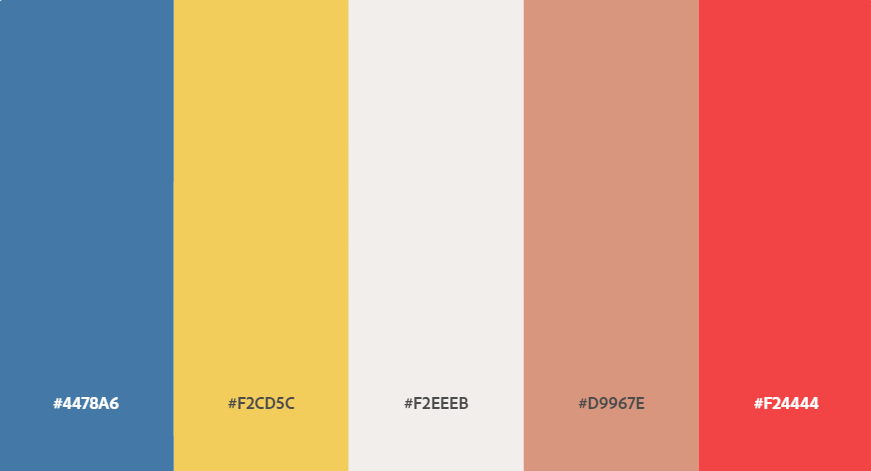

# cookie-manager-nextjs
How to create &amp; manage cookies for auto sign in

# How-to

## First steps
- Verify you have docker and **docker-compose**
- Exec `docker-compose pull`
- Exec `docker-compose build`
- Exec `docker-compose up -d`
- Verify all ports are fine
    - 1337: Back-end (CMS - Strapi)
    - 80: Front-end (Create React App) / Home
    - 3010: Front-end (Next.js) / Blogs
    - 3020: Front-end (Next.js) / Notes
    - 3030: Front-end (Next.js) / Photos

## Simple commands
Using a `makefile`, there are commands to simplify larger ones
- `init`: Start containers & network
- `stop`: Stop & delete containers & network
- `open_db`: Open a session for MySQL database

# Color palette

# References
- [Utilizando Fetch](https://developer.mozilla.org/es/docs/Web/API/Fetch_API/Utilizando_Fetch)
- [NodeJS: Making docker-compose Volumes Ignore the node_modules Directory](https://medium.com/@semur.nabiev/how-to-make-docker-compose-volumes-ignore-the-node-modules-directory-99f9ec224561)
- [Passphrase Generator for Machine and Sysadmin Use](https://www.ssh.com/ssh/passphrase-generator)
- [Cookies administrator - NextJs](https://github.com/vercel/next.js/blob/canary/examples/with-passport/pages/api/login.js)
- [Next.js: How to get and set cookies](https://maxschmitt.me/posts/next-js-cookies/)
- [fetch() cheatsheet](https://devhints.io/js-fetch)
- [The Fetch API Cheatsheet: Nine of the Most Common API Requests](https://www.freecodecamp.org/news/fetch-api-cheatsheet/)

## Tailwind
- [Sticky Header and Footer with Tailwind](https://dev.to/cryptic022/sticky-header-and-footer-with-tailwind-2oik)
- [Centered Page with TailwindCss](https://www.tailwindtoolbox.com/components/centered-page)
- [Divided register template](https://github.com/davidgrzyb/tailwind-auth-template)
- [Display image with Next.js & Tailwind](https://github.com/vercel/next.js/issues/19471)
- [Shuffle Editor - Tailwind bootstrap](https://shuffle.dev/editor)

